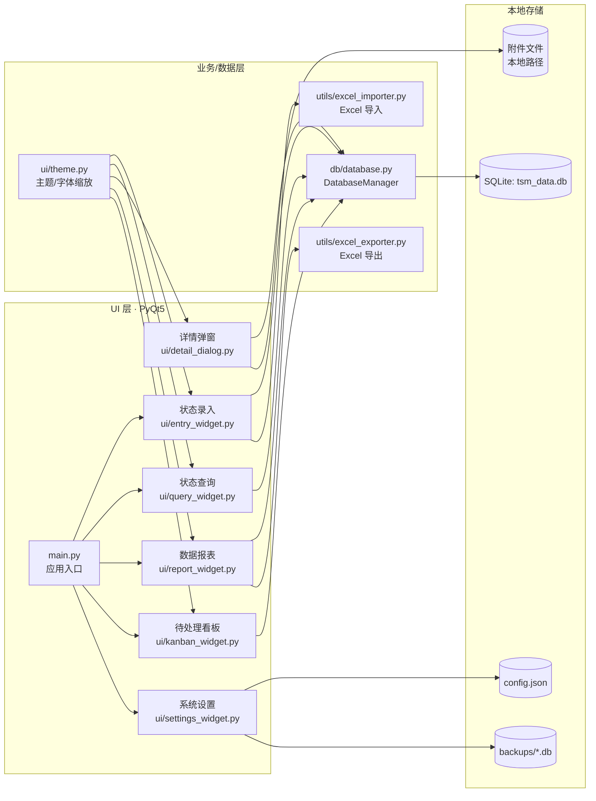
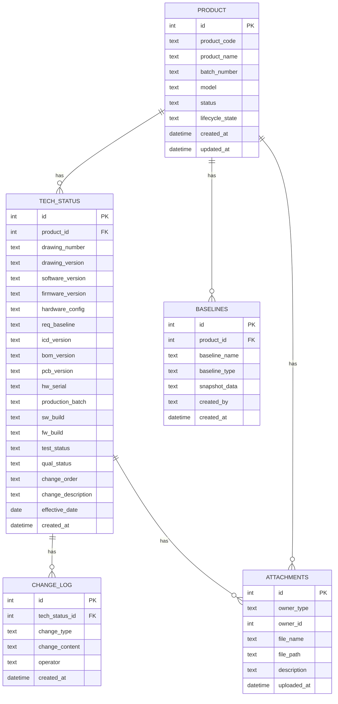

# 技术状态管理助手 — 详细架构与技术信息说明

## 1. 系统架构概览



## 2. 录入/变更流程（含导入）

```mermaid
flowchart TD
    A[用户录入或导入] --> B{录入模式}
    B -->|新建产品| C[写入 product]
    B -->|变更录入| D[读取 product]

    C --> E[写入 tech_status
(最新技术状态)]
    D --> E

    E --> F[写入 change_log
(变更类型/内容/操作者)]

    A --> G{Excel 导入}
    G --> H[解析表头与字段]
    H --> E
    H --> C

    E --> I[详情页/查询页显示]
    F --> I
```

要点：
- 手工录入界面主要填写“变更相关字段”，技术状态字段（如图号、版本等）在当前代码中主要来自 Excel 导入或后续扩展。
- 每次新增/更新技术状态都会记录到变更日志 `change_log` 中，用于历史追溯。

## 3. 分析与报表流程

```mermaid
flowchart LR
    DB[(SQLite)] --> Stats[统计卡片
总记录/正式/草稿]
    DB --> Dist[型号分布图
matplotlib]
    DB --> Export[导出 Excel
(含技术状态字段)]
    DB --> Board[待处理看板
缺失更改/未落实]
```

### 看板规则（代码内置）
- 仅当“更改单号/技术通知单号/工艺更改单号”有效时才进入筛选。
- 若“涉及更改图样”为空 → 进入【缺失更改】列。
- 若“已落实情况”为空或不等于“已落实” → 进入【未落实】列。

## 4. 数据库 ER 图（核心表）



## 5. 技术信息字段明细（录入/分析）

### 5.1 产品基础信息（product）
| 分类 | 字段 | 说明 | 录入方式 | 用途 |
|---|---|---|---|---|
| 产品标识 | product_code | 产品代号（唯一） | 手工/Excel | 检索、索引 |
| 产品标识 | product_name | 产品名称 | 手工/Excel | 显示、报表 |
| 批次 | batch_number | 批次编号 | 手工/Excel | 追溯 |
| 型号 | model | 所属型号 | 手工/Excel | 分布统计 |
| 状态 | status | active/draft/inactive | 系统维护 | 统计与过滤 |
| 生命周期 | lifecycle_state | draft/review/released/obsolete | 系统维护 | 流程控制 |
| 时间 | created_at/updated_at | 创建/更新时间 | 系统维护 | 审计 |

### 5.2 技术状态字段（tech_status）
| 分类 | 字段 | 说明 | 录入方式 | 典型用途 |
|---|---|---|---|---|
| 设计文档 | drawing_number | 图号 | Excel/扩展录入 | 查询、导出 |
| 设计文档 | drawing_version | 图纸版本 | Excel/扩展录入 | 追溯 |
| 软件 | software_version | 软件版本/构建 | Excel/扩展录入 | 追溯 |
| 固件 | firmware_version | 固件版本/构建 | Excel/扩展录入 | 追溯 |
| 硬件 | hardware_config | 硬件配置 | Excel/扩展录入 | 追溯 |
| 基线 | req_baseline | 需求基线 | Excel/扩展录入 | 追溯 |
| 基线 | icd_version | 接口基线 | Excel/扩展录入 | 追溯 |
| 基线 | bom_version | BOM 版本 | Excel/扩展录入 | 追溯 |
| 基线 | pcb_version | PCB 版本 | Excel/扩展录入 | 追溯 |
| 硬件 | hw_serial | 硬件序列号 | Excel/扩展录入 | 追溯 |
| 生产 | production_batch | 生产批次 | Excel/扩展录入 | 追溯 |
| 构建 | sw_build | 软件构建号（预留） | Excel/扩展录入 | 预留 |
| 构建 | fw_build | 固件构建号（预留） | Excel/扩展录入 | 预留 |
| 试验 | test_status | 测试状态 | Excel/扩展录入 | 统计/看板 |
| 放行 | qual_status | 合格状态 | Excel/扩展录入 | 统计/看板 |
| 变更 | change_order | 更改单号等（组合字段） | 手工/Excel | 看板/追溯 |
| 变更 | change_description | 更改内容（组合字段） | 手工/Excel | 看板/追溯 |
| 时间 | effective_date | 生效日期 | 手工/Excel | 追溯 |
| 时间 | created_at | 记录创建时间 | 系统维护 | 追溯 |

> 说明：`change_order` 和 `change_description` 为“标签:值”的组合字段，来源于录入页面与 Excel 表头映射。

### 5.3 变更追溯字段（change_log）
| 字段 | 说明 | 示例 |
|---|---|---|
| change_type | create/update/lifecycle 等 | "update" |
| change_content | 变更内容摘要 | "Excel导入更新 XXX" |
| operator | 操作人（默认“系统”） | "系统" |
| created_at | 变更时间 | 2026-01-20 10:30:00 |

## 6. 录入字段（当前界面）与分析字段对照

### 6.1 当前界面可直接录入字段（ui/entry_widget.py）
- 产品基础：产品代号、产品名称、批次编号、所属型号
- 变更信息（最终汇总至 change_order / change_description）：
  - 协调单号、更改建议单号、更改单号/技术通知单号/工艺更改单号
  - 所属阶段、更改类别、更改原因、更改人、处理意见、更改理由
  - 更改建议单涉及图样/文件、涉及更改图样
  - 需落实产品编号、已落实情况、未落实产品编号、工艺更改落实情况
  - 备注、生效日期

### 6.2 当前报表/导出涵盖字段（ui/report_widget.py）
- 产品基础：ID、产品代号、产品名称、批次编号、所属型号、状态、创建时间
- 技术状态：图号、图纸版本、软件版本、固件版本、硬件配置、需求基线、接口基线、BOM版本、PCB版本、硬件序列号、生产批次、测试状态、合格状态
- 变更字段：更改单号、更改内容、生效日期

---

如需我把该文档挂到现有说明文档里（比如 `技术状态管理小程序开发文档.md`）或调整成公司模板/流程图样式，告诉我目标格式即可。
